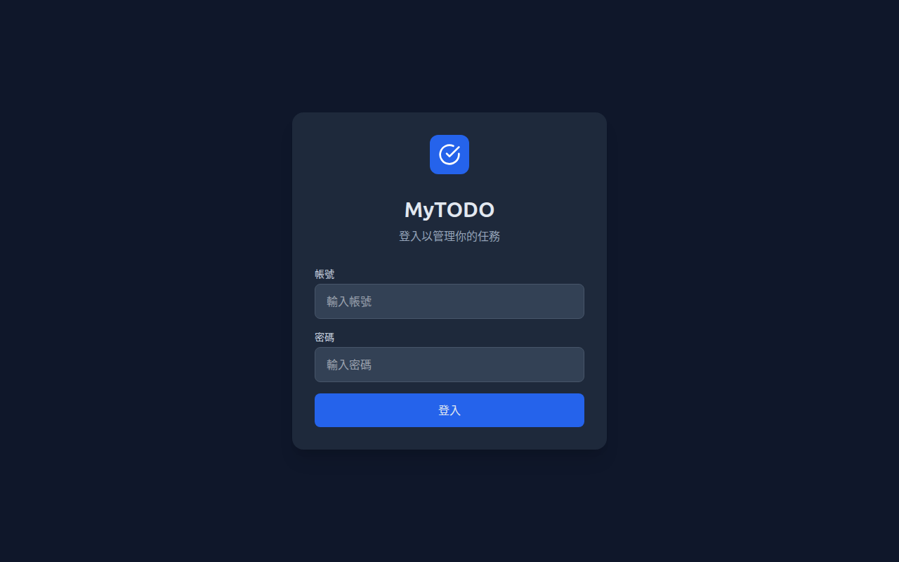
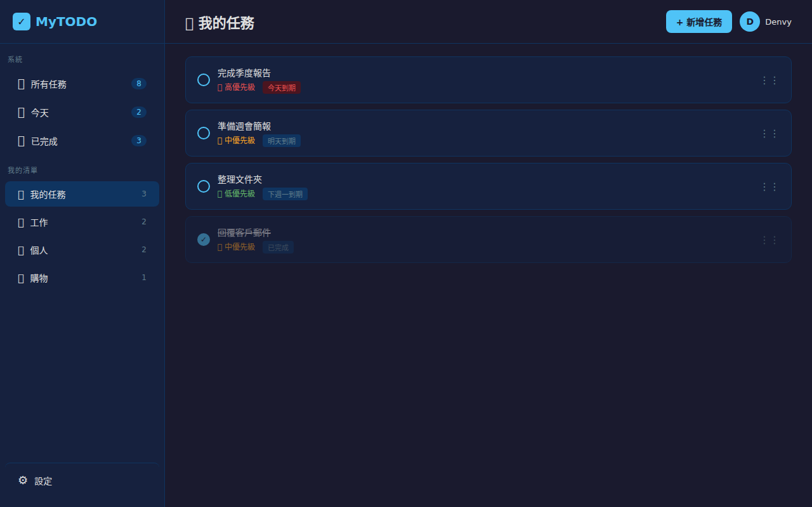

# How I Built an Entire Web App by Talking to AI (And How You Can Too)

> I didn't write a single line of code. I described what I wanted in plain language through Telegram, and an AI assistant built, tested, and deployed a full-stack application for me. This is the complete story — including every prompt I used.

---

## 📸 What It Looks Like

**Login Page:**


**Dashboard with Tasks:**


---

## 🎯 The Real Point of This Article

This is **not** a tutorial about building a to-do list app. There are thousands of those.

This is a tutorial about **how to use AI to build software** — even if you can't code. The to-do app (which I call MyTODO) is just the vehicle. What I want to share is the **process**: how to break down an idea, communicate it to an AI, iterate on the results, and end up with production-quality software.

By the end, you'll understand:
- How to structure your requests so the AI produces good code
- How to build complex software in phases (not all at once)
- How to test, debug, and deploy — all through conversation
- Why "prompt engineering for coding" is a real and learnable skill

**Spoiler: The app ended up with 94.69% test coverage, 83 automated tests, and runs 24/7 on my home server — accessible worldwide via HTTPS. And I never opened a code editor.**

---

## 🖥️ My Setup (Nothing Special Required)

| Component | Details |
|---|---|
| **Host OS** | Windows 11 + WSL2 (Ubuntu 24.04) |
| **AI Platform** | [OpenClaw](https://github.com/openclaw/openclaw) 2026.3.28 → 2026.4.10 |
| **AI Model** | GLM-4 (via z.ai) + local Gemma models |
| **Communication** | Telegram (I chatted with the AI on my phone) |
| **Code Editor** | None used |
| **Deployment** | Home server + Cloudflare Tunnel |
| **Cost** | $0 (all tools are free/open-source) |

The key insight: **I used OpenClaw, which is an open-source AI agent platform.** It runs on your machine, has access to your filesystem, can execute commands, and talks to you through messaging apps like Telegram. But the principles I share here apply to any AI coding assistant — ChatGPT, Claude, Cursor, whatever you use.

---

## 🧠 The Mindset: You Are a Product Manager, Not a Programmer

When you build software with AI, your role changes. You're no longer the person writing code. You become the **product manager** — someone who:

1. **Defines what to build** (features, user experience, constraints)
2. **Breaks work into phases** (don't ask for everything at once)
3. **Reviews the output** (does it work? does it look right?)
4. **Iterates** (fix bugs, add features, refine)

The AI is your development team. It writes code, runs tests, installs packages, and deploys. But it needs clear direction.

Think of it like this: If you can explain an idea clearly enough that a human developer could build it, you can explain it clearly enough for an AI.

---

## 💬 The Complete Prompt Sequence

Here are the actual prompts I sent to build MyTODO, organized by phase. Each prompt builds on the previous one. **This is the most important part of the article** — study the structure, not just the content.

### Phase 1: Lay the Foundation

**Prompt 1 — Define the Vision:**
> I want to build a to-do list web application similar to Microsoft To Do. The tech stack should be:
> - Backend: Node.js + Express + SQLite + JWT authentication
> - Frontend: React + Vite + Tailwind CSS
> - Notifications: Telegram Bot + Email (Nodemailer)
> 
> Features needed:
> - User registration and login
> - Multiple task lists (e.g., Work, Personal, Shopping)
> - Task CRUD with title, description, priority (high/medium/low), due date/time
> - Drag and drop sorting
> - Telegram and email reminders when tasks are due
> 
> Create the project structure and implement the backend first.

**Why this works:**
- ✅ Specific tech stack (not "make a web app")
- ✅ Clear feature list
- ✅ Scoped to backend only (first things first)
- ✅ Provides a reference point ("like Microsoft To Do")

**Prompt 2 — Add the User Interface:**
> Now create the React frontend with:
> - A modern login/register page
> - A dashboard with a sidebar showing all lists
> - Task cards that can be dragged between lists
> - A modal for creating/editing tasks with all fields
> - Tailwind CSS for styling, dark theme by default

**Prompt 3 — Connect Everything:**
> Create the API layer in the frontend to connect to the backend:
> - Auth API (login, register, token management)
> - Lists API (CRUD for lists)
> - Tasks API (CRUD for tasks)
> - Handle JWT tokens in localStorage
> - Error handling and loading states

---

### Phase 2: Make It Good (Not Just Working)

**Prompt 4 — UI Polish:**
> Add these UI improvements:
> - Sidebar should be collapsible (toggle button)
> - Each list gets a random colorful icon (30 unique options)
> - Add "All Tasks" view showing tasks from all lists
> - Add "Today" filter showing tasks due today
> - Add "Completed" section for finished tasks
> - Dragging a task to a different list should change its list_id

**Why this phase matters:** The first phase gets you a working product. This phase makes it a **good** product. Never try to polish in phase 1 — get it working first.

**Prompt 5 — Multi-language Support:**
> Add internationalization (i18n) to the app:
> - Support English and Traditional Chinese (zh-TW)
> - Add a language toggle in the settings
> - Create locale files for all UI text

---

### Phase 3: Quality Assurance

**Prompt 6 — Automated Testing:**
> Write comprehensive tests for the backend:
> - Test all auth routes (register, login, invalid credentials)
> - Test all CRUD operations for lists and tasks
> - Test authorization (users can only access their own data)
> - Test edge cases (empty fields, duplicate names, invalid IDs)
> - Use Jest + Supertest
> - Target 90%+ code coverage

**Result:** 83 tests, 94.69% coverage. The AI wrote every single test. I just asked.

**Why testing matters when using AI:** AI-generated code usually works for the happy path. But edge cases — empty inputs, unauthorized access, duplicate data — are where bugs hide. Asking the AI to write tests forces it to think about these cases, and gives you confidence that the code is solid.

---

### Phase 4: Ship It

**Prompt 7 — Deployment Automation:**
> Create a deployment script that:
> - Installs all dependencies (npm install for both client and server)
> - Builds the React frontend for production
> - Creates a systemd service file so the app starts on boot
> - The server should serve the built frontend in production mode
> - Use port 3001

**Prompt 8 — Public Access:**
> Help me set up a Cloudflare Tunnel to make the app publicly accessible:
> - I have the domain `first.pet` on Cloudflare
> - I want the subdomain `mytodo.first.pet`
> - Set up a named tunnel (not quick tunnel)
> - Create a systemd service for the tunnel so it auto-starts

**Deployment architecture:**
```
Any Device ──▶ Cloudflare CDN (HTTPS) ──▶ Tunnel ──▶ My Home Server
               mytodo.first.pet                       (port 3001)
```

---

### Phase 5: Iterate Based on Real Usage

**Prompt 9 — Bug Fixes:**
> Fix these issues:
> - When a task is moved to another list via drag-and-drop, it should disappear from the old list immediately (not on refresh)
> - The task count in each list should update in real-time
> - Add a confirmation dialog before deleting a list

**This is how real software development works.** You build, you use, you find problems, you fix them. The AI makes this loop incredibly fast.

---

## 🔑 The 7 Principles of AI-Assisted Coding

After building multiple projects this way, here's what I've learned:

### 1. Be Specific About the Tech Stack
❌ "Make a web app"
✅ "Use React + Express + SQLite with JWT authentication"

The AI will choose randomly if you don't specify. Random choices lead to incompatible technologies.

### 2. Define Features as Bullet Points
❌ "It should have all the normal features"
✅ "Features: user login, multiple lists, drag and drop, due dates, priority levels"

### 3. Build in Phases (This Is Critical!)
The biggest mistake beginners make: asking for everything in one prompt. The AI will try to do it all, and the result will be a mess.

**The correct approach:**
1. Foundation (backend + basic frontend)
2. Features (drag and drop, notifications)
3. Polish (UI improvements, animations)
4. Quality (tests, error handling)
5. Deploy (scripts, tunnels, services)
6. Iterate (bug fixes, new features)

### 4. Provide a Reference
"I want something like Microsoft To Do" immediately gives the AI a mental model of the UI, features, and user experience.

### 5. Review and Iterate
After each phase, look at the result. Does it work? Does it look right? Then ask for changes. This is normal — even human developers iterate through many versions.

### 6. Ask for Tests Early
Tests catch bugs before you deploy. They also serve as living documentation of how the code should behave.

### 7. Deploy Gradually
Don't wait until everything is perfect. Deploy early, use it yourself, and fix issues as they come up.

---

## 🤖 What the AI Actually Did (Behind the Scenes)

For each prompt, the AI assistant:

1. **Created files** — wrote all source code from scratch
2. **Installed dependencies** — ran `npm install` automatically
3. **Executed tests** — ran the test suite and reported coverage
4. **Deployed** — SSHed into my server and set up services
5. **Configured infrastructure** — set up Cloudflare Tunnel, systemd services

**Total time from first prompt to production:** About 3 days of casual chatting on Telegram.

**Lines of code I wrote:** Zero.

---

## 📊 Project Stats

| Metric | Value |
|---|---|
| Source code | ~3,000+ lines |
| Test coverage | 94.69% |
| Tests written | 83 |
| Days from idea to production | ~3 |
| Lines of code I typed | 0 |
| Cost | $0 (all free/open-source tools) |

---

## 🚀 How to Get Started Today

1. **Set up an AI coding assistant.** Options:
   - [OpenClaw](https://github.com/openclaw/openclaw) (what I used — open source, self-hosted)
   - [Cursor](https://cursor.sh) (VS Code fork with AI)
   - [Claude Code](https://claude.ai) (Anthropic's coding agent)
   - ChatGPT / GitHub Copilot

2. **Pick a simple project.** A to-do list, a blog, a URL shortener — anything you'd actually use.

3. **Follow the phased approach** from this article. Foundation → Features → Polish → Test → Deploy → Iterate.

4. **Use my prompts as templates.** Adapt them to your project. The structure is what matters, not the specific words.

---

## 📦 Source Code

The complete source code for MyTODO is included in the [`src/`](./src/) directory of this repository. Feel free to use it as a reference or starting point.

---

## 🙌 Final Thoughts

The barrier to building software has never been lower. You don't need to spend years learning to code. You need to learn how to **describe what you want clearly** — and that's a skill anyone can develop.

The process I've shared here isn't specific to to-do apps. It applies to any software project:
- Want a personal finance tracker? Same approach.
- Want an inventory management system? Same approach.
- Want a blog engine? Same approach.

**Define it clearly. Build it in phases. Test it. Ship it. Iterate.**

The AI handles the code. You handle the vision.

---

*Built entirely through AI conversation by [Denvy Shi](https://github.com/Denvy-Shi)*
*Powered by [OpenClaw](https://github.com/openclaw/openclaw) — open-source AI agent platform*
